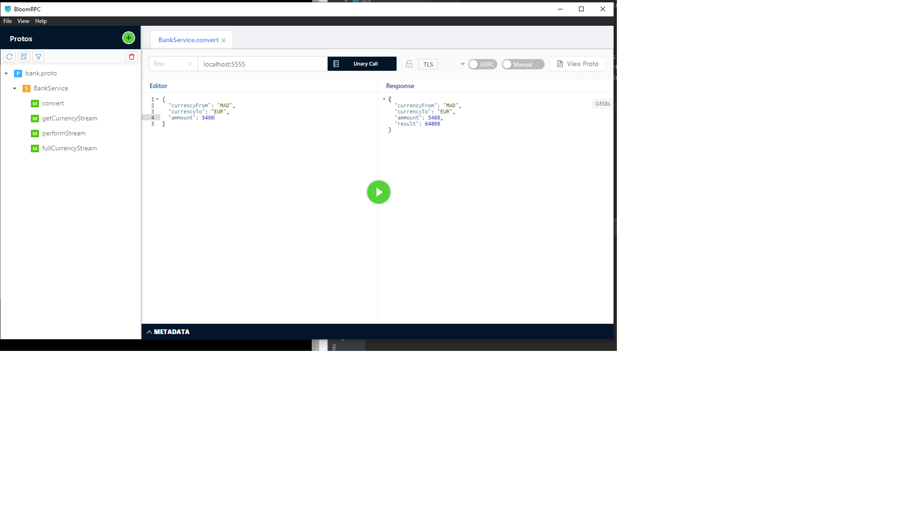
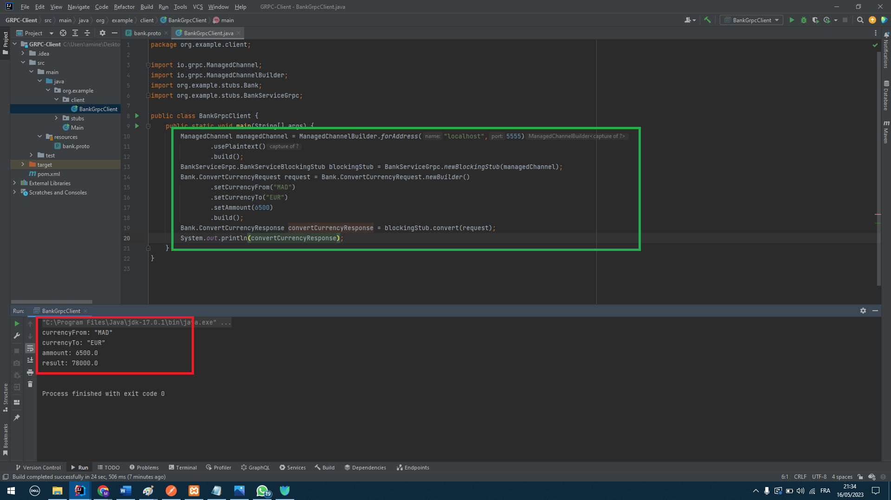
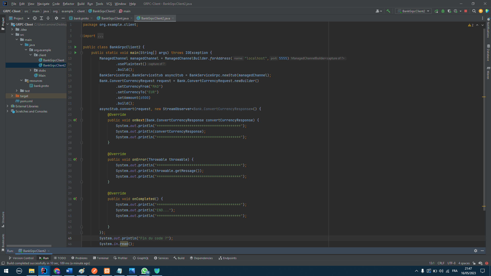
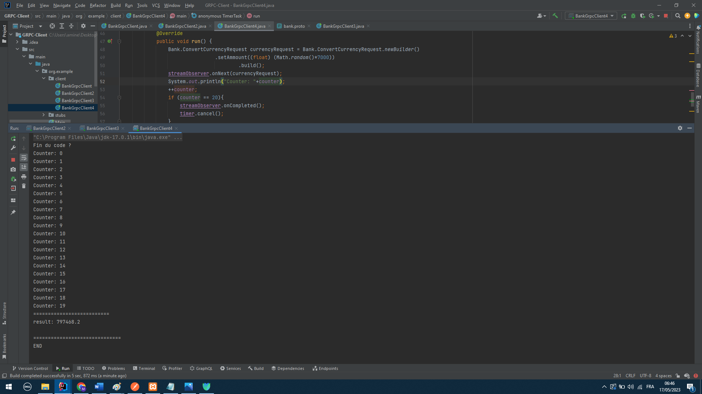

<h1>GRPC-Model</h1>
<h3>Les pré-requis:</h3>
<ul>
<li>Protocole buffer java</li>
<li>Protocole buffer</li>
<li>GRPC Netty</li>
<li>GRPC Stub</li>
<li>Javax annotation</li>
</ul>

Et un plugin sui cherche le fichier .proto dans src/main/resources pour le compiler
pour faire la compilation fu fichier .proto
on va sur Maven on va sur lifecycle on selectionne validate et package.

Après cela la compilateur Maven me génére deux fichiers

<ul>
<li>Bank</li>
<li>BankServiceGrpc</li>
</ul>

Pour tester notre configuration:

On crée un serveur GRPC et on utilise BloomRPC

<h2>Création d'un client GRPC</h2>

Pour créer un GRPC client on suit les mêmes étapes:

<ul>
<li>On importe les dépendance Maven</li>
<li>On importe le même fichier .proto</li>
<li>On génére les class Bank et BankServiceGrpc</li>
</ul>
<h3>Communication GRPC</h3>

Dans un protocole GRPC, il y a deux type de communication

<h3>Communication bloquante (Synchrone)</h3>

Pour faire une communication synchrone on indique l'adresse du serveur au service client,
on configure nos données et on appelle blockingstub c'est elle qui indique que la communication entre le serveur et le client est une communication bloquante (Carré en vert)

<h3>Communication non-bloquante (Asynchrone)</h3>

Pour faire une communication asynchrone on indique l'adresse du serveur au service client,
on configure nos données et on appelle newstub c'est elle qui indique que la communication entre le serveur et le client est une communication non-bloquante
, sauf que cette methode retourne un StreamObserver qui est une interface, ou il faut redéfinir les methodes lors de la compilation, on peut remarquer que
le message "Fin du code ?" s'affiche en premier après le resultat du request vient après cela prouve que la communication entre le serveur et le client est asynchrone

<h3>Récupérer un Stream en entré et envoyer un résultat</h3>

